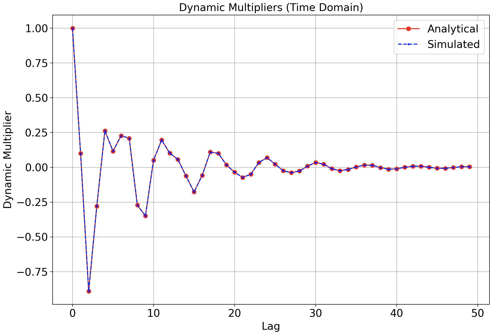
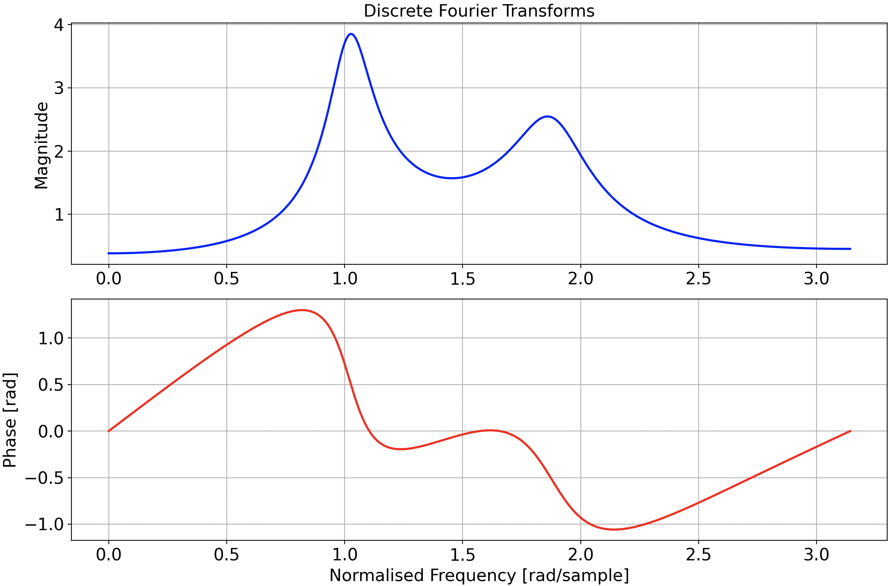
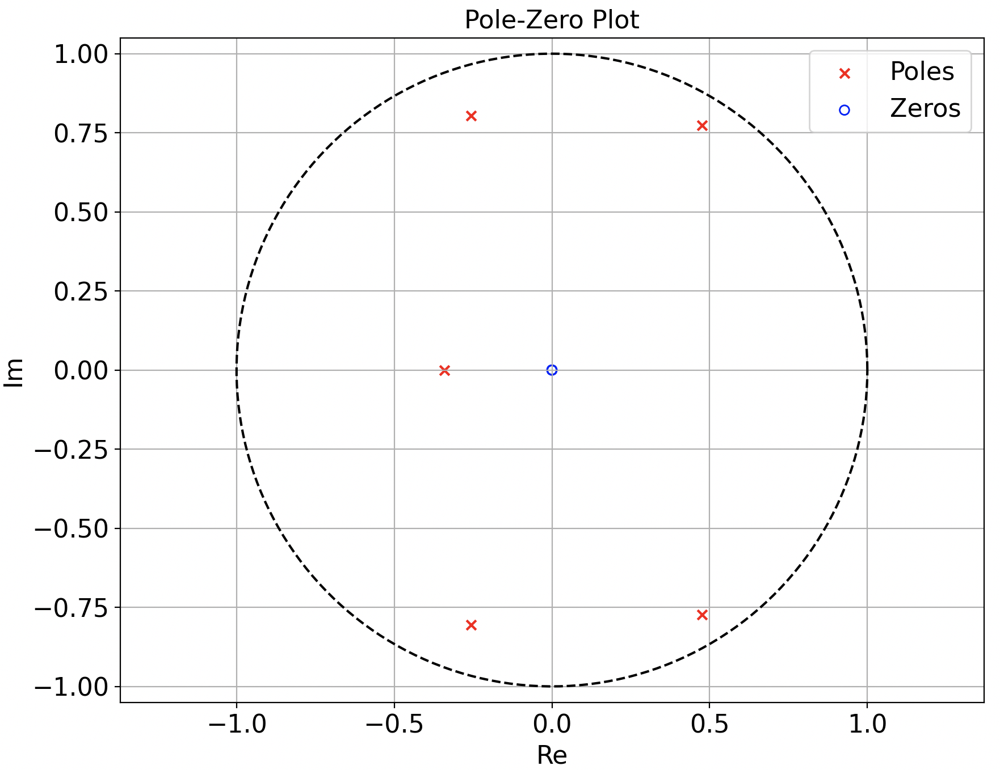

# recurrence-signal-processing
Example of discrete-time LTI system simulation. This project explores the effect of lag (time index) on the dynamic multiplier of a recurrence relation (specifically a difference equation) using three approaches:

- Direct simulation (matrix powers)
- Companion matrix method
- Fourier analysis method

The user can define a pth order difference equation in `constants.py` where the common multipliers can be defined.

## Background

A pth order difference equation depends on multiple previous values:  

$$
y_t = \phi_1 y_{t-1} + \phi_2 y_{t-2} + \ldots + \phi_p y_{t-p} + w_t
$$  

Where:
- $y_t$ is the system output at step $t$
- $\phi_i$ are coefficients
- $w_t$ is a non-homogeneous term (e.g., an external input or disturbance)

The dynamic multiplier measures the effect of an initial disturbance $w_0$ on a future output $y_{t+j}$:  

$$
\frac{\partial y_{t+j}}{\partial w_t}
$$

## Direct Simulation

Dynamic multipliers can be computed directly by recursively multiplying the system’s companion matrix:  

$$
(F^j)_{11} = \frac{\partial y_{t+j}}{\partial w_t}
$$  

Where $F$ is constructed from the $\phi$ coefficients as the companion matrix (see below). This approach simulates the actual time-domain evolution of the system.

## Companion Matrix Approach

The pth order equation can be rewritten as a first-order vector system:  

$$
\xi_t = F \, \xi_{t-1} + v
$$  

Where:
- $\xi_t = [y_t, y_{t-1}, \dots, y_{t-p+1}]^\top$
- $v = [w_t, 0, \dots, 0]^\top$
- $F$ is the companion matrix (also known as the state space transition matrix):  

$$
F = \begin{bmatrix} \phi_1 & \phi_2 & \cdots & \phi_p \\ 1 & 0 & \cdots & 0 \\ 0 & 1 & \cdots & 0 \\ \vdots & \vdots & \ddots & \vdots \\ 0 & 0 & \cdots & 1 \end{bmatrix}
$$  

This approach provides a compact linear algebra formulation and forms the basis for analytical derivations.

## Fourier Analysis Approach

The system can also be analysed in the frequency domain. Using the eigenvalues $\lambda_i$ of $F$, the dynamic multiplier can be expressed as:  

$$
\frac{\partial y_{t+j}}{\partial w_t} = \sum_{i=1}^{p} c_i \lambda_i^j
$$  

Where $c_i$ are coefficients calculated from the eigenvalues. This approach gives the **frequency response** and allows plotting magnitude and phase.

## Project Structure

- `constants.py`: defines $\phi$ values, lag range, and frequency resolution  
- `simulation.py`: constructs the companion matrix, calculates eigenvalues, and simulates dynamic multipliers  
- `signal_process.py`: computes frequency response, plots time-domain multipliers, Fourier response, and pole-zero diagrams  
- `main.py`: example workflow tying all components together

## Visualisations

1. Time-domain dynamic multipliers: shows the effect of a disturbance across discrete lags
2. Frequency response: magnitude and phase vs normalised frequency  
3. Pole-zero plot: Locations of system poles (eigenvalues of the companion matrix) and zeros

The following below is the response of the example defined in `constants.py` which is a 4th order difference equation:

